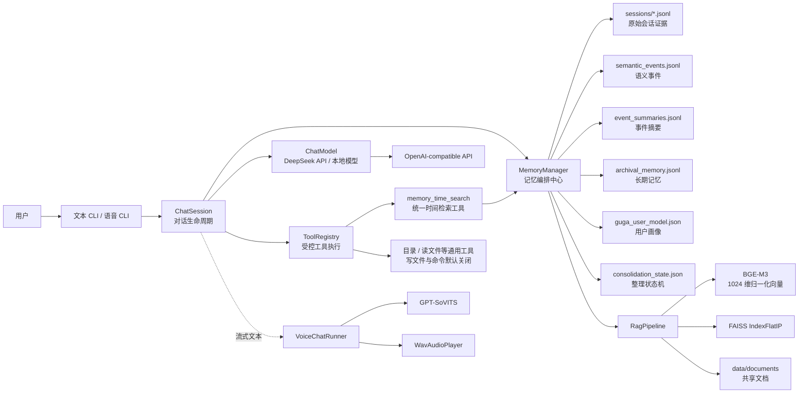
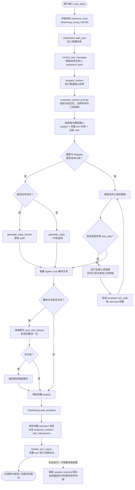
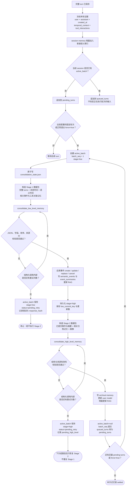
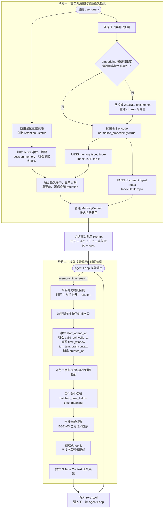
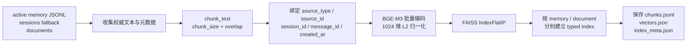
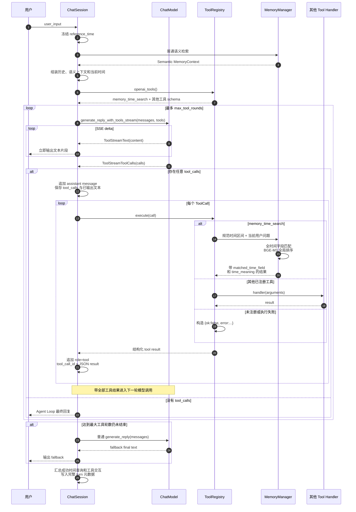
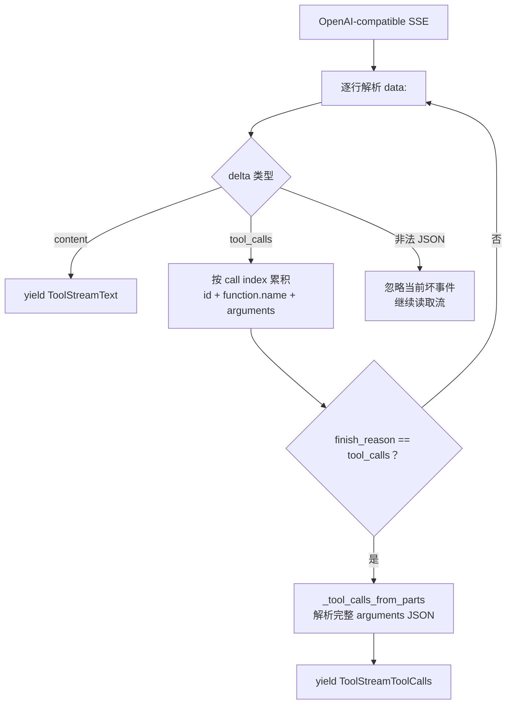
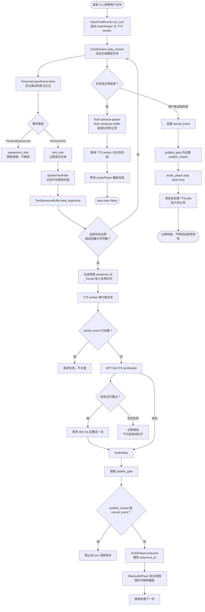
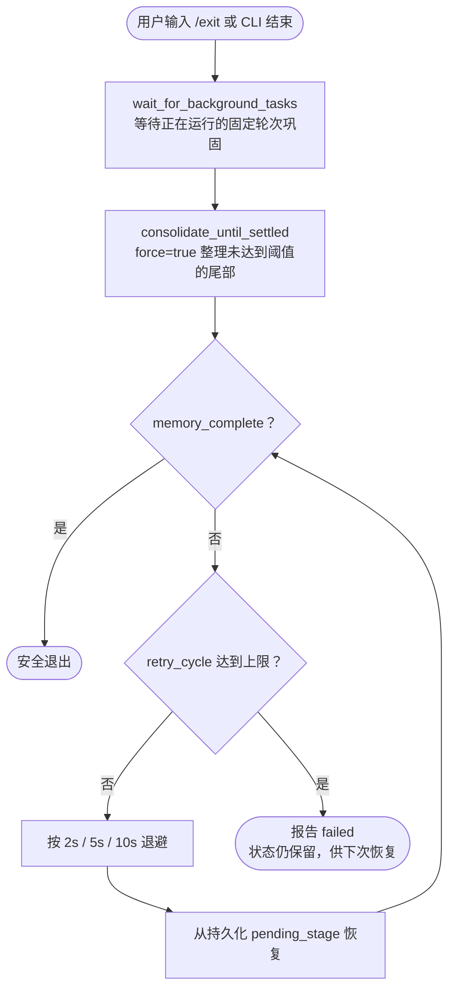

# Guga 核心流程图与面试讲解

## 1. 文档范围

本文以已经确认的“时间记忆检索与异步巩固设计”为目标流程，并结合当前 `main` 分支中不受该设计影响的既有链路，覆盖六条核心执行链路：

1. 一次完整聊天 turn。
2. 两阶段异步记忆巩固与失败恢复。
3. 普通语义检索与独立时间检索。
4. Agent Tool Calling 循环。
5. 流式文本到 TTS 播放的语音链路。
6. 正常退出时的尾批记忆巩固。

LangGraph 任务运行时仍位于 `feat/langgraph-agent-runtime`，不混入本文。待该分支同步主线后，应单独补充任务规划、审批、工具执行和断点恢复流程。

时间检索、turn 元数据和固定轮次/退出巩固部分表达的是目标设计；其余方法名、状态名和主要分支来自当前代码。功能实现完成前，不能把目标设计描述成已经上线的行为。为了保证面试时可读，图中省略纯配置读取、日志格式化和简单数据转换。

---

## 2. 系统总览



### 这张图要讲清的工作

- `ChatSession` 只编排一次对话，不直接实现记忆算法、FAISS 或工具细节。
- `MemoryManager` 是系统核心边界，负责“首次生成前的普通语义检索”“Agent Loop 中的时间工具检索”和“完整 turn 后的异步巩固”。
- 原始消息、事件、摘要、画像分开存储，因为它们的可信度、更新方式和用途不同。
- FAISS 负责普通语义候选召回；时间工具先按结构化时间字段筛选，再使用 BGE-M3 对时间候选统一排序。
- Tool Calling 和语音建立在同一个聊天生命周期上，没有复制一套独立对话状态。

### 对应代码

- `guga/chat/session.py::ChatSession`
- `guga/memory/manager.py::MemoryManager`
- `guga/rag/pipeline.py::RagPipeline`
- `guga/tools.py::ToolRegistry`
- `guga/voice/runner.py::VoiceChatRunner`

---

## 3. 一次完整聊天 Turn



### 面试讲解顺序

#### 3.1 先写原始消息，再做检索

用户消息先进入短期 `ChatHistory`，同时写入 session JSONL。原始消息是后续事件和摘要的证据，不能只保存在内存中。

当前 turn 也会形成 session memory，但普通语义检索仍需识别当前 turn，避免同一句用户输入既出现在消息末尾，又作为 RAG 记忆重复注入。

#### 3.2 检索和生成职责分离

`prepare_context()` 只负责首次调用前的普通语义记忆，`compose_system_prompt()` 决定这些记忆如何进入 prompt。时间检索不在这里与语义结果求交，而是在 Agent Loop 中由模型调用 `memory_time_search` 后独立返回。

#### 3.3 流式只是传输方式，不改变持久化语义

流式模式逐块向用户输出，但只有流结束后才把拼接完成的回答保存为一条 assistant 消息。这样不会把每个 token 写成独立记录，也不会让长期整理读取碎片。

#### 3.4 回答路径和记忆写回解耦

回答保存后，一个 turn 才算完整。系统把用户消息、助手最终回复、消息时间、本轮成功执行的规范时间查询以及工具交互统一关联到该 turn，再由单 worker 按固定轮次异步巩固；正常退出时补齐剩余 turn。

#### 3.5 空回复有确定性降级

模型返回空文本时，系统提高生成 token 上限重试一次；再次失败才返回固定提示。避免把空回答保存为正常 assistant turn。

#### 3.6 没有时间意图不等于直接结束

时间意图只决定模型是否调用 `memory_time_search`。模型即使没有时间意图，也可能调用文件、目录或其他工具；Agent Loop 只在模型不再返回任何工具调用时结束。

### 能体现的工程工作

- 设计完整 turn 生命周期，而不是只调用一次 API。
- 处理流式、非流式和多轮 Tool Calling 三种生成路径。
- 保证原始证据先落盘、完整回答后落盘。
- 把时间解析结果和工具交互绑定到完整 turn，而不是混入用户可见文本。
- 将用户可见延迟与长期记忆整理延迟解耦。
- 设计空响应降级和 graceful shutdown 时的尾部整理。

### 对应代码

- `guga/chat/session.py::reply()`
- `guga/chat/session.py::reply_stream()`
- `guga/chat/session.py::settle_memory_for_shutdown()`
- `guga/memory/manager.py::finalize_turn_async()`

---

## 4. 两阶段长期记忆整理与恢复



### 持久化状态的关键结构

```text
session_state
├─ pending_turns        尚未进入批次的完整 turns
├─ active_batch         当前冻结执行的批次
│  ├─ batch_seq
│  ├─ stage             low | high
│  ├─ status            retrying | pending_retry
│  ├─ turns
│  ├─ attempt_count
│  ├─ retry_cycle
│  ├─ low_level_updates
│  └─ low_commit_key
├─ queued_turns         active_batch 运行期间新到达的 turns
├─ pending_high_level   Stage 2 失败后的恢复信息
└─ consolidation_batches / 各类统计
```

### 面试讲解顺序

#### 4.1 为什么分成两阶段

Stage 1 处理事实层的语义事件和事件总结，Stage 2 处理归档记忆和用户画像。如果一次调用同时生成所有层，模型可能在事实尚未校验时继续做高层推断，也无法在部分失败后准确恢复。

#### 4.2 Stage 1 做什么

输入是本批次完整 turns、每条消息的 `created_at`、每轮 `temporal_context`、工具交互，以及最近和语义相关的现有记忆。输出是受约束的语义事件操作与事件摘要。事件操作必须引用允许范围内的目标事件和来源消息，模型不能任意修改不相关历史。

#### 4.3 Stage 2 做什么

Stage 2 读取已经校验并落盘的事件和事件摘要，再生成或修改归档记忆与用户画像。高层记忆因此依赖已提交的低层事实，而不是直接信任未经校验的原始模型输出。

#### 4.4 为什么 Stage 2 失败不能重跑 Stage 1

Stage 1 已经产生事件写入副作用。成功后先把状态持久化为 `stage=high`，再运行 Stage 2。即使进程重启，恢复逻辑也会看到 high 状态，只重试高层阶段，避免重复创建事件。

#### 4.5 pending、active 和 queued 为什么分开

active batch 的输入一旦冻结，执行期间新到达的 turns 只能进入 `queued_turns`。否则模型调用过程中批次输入发生变化，会导致幂等键、来源范围和恢复语义失效。

#### 4.6 结构校验能保证什么

它能够发现非法 JSON、字段类型错误、非法操作枚举、缺失必填字段和越界来源 ID，但不能证明模型的语义判断一定正确。因此系统仍保留原始消息、置信度和事件生命周期。

#### 4.7 为什么按固定轮次和退出触发

固定轮次触发把多轮上下文放在同一个巩固批次中，同时避免每轮都增加一次后台模型调用；正常退出触发负责处理尚未达到阈值的尾批。两种触发都只消费尚未巩固的 turn，并通过持久化水位避免重复处理。

### 能体现的工程工作

- 将概率性 LLM 放入确定性状态机，而不是允许模型直接写文件。
- 设计事实层到高层记忆的单向依赖。
- 实现分阶段提交、失败记录、重启恢复和防重复执行。
- 处理整理过程中继续到达的新 turn。
- 使用临时文件替换保存状态快照。
- 为 Stage 1/Stage 2 失败和恢复编写专门测试。

### 必须诚实说明的边界

- 当前不是数据库事务，也不是严格 exactly-once。
- 单 worker 和进程内锁不解决多进程写入。
- 文件写入与状态推进之间仍存在极端崩溃窗口。
- 生产多用户版本应使用数据库唯一约束、事务与分区任务队列。

### 对应代码

- `guga/memory/manager.py::_finalize_turn_state()`
- `guga/memory/manager.py::_consolidate_pending_turns()`
- `guga/memory/manager.py::_run_high_stage()`
- `guga/memory/manager.py::_mark_active_batch_failure()`
- `guga/memory/summarizer.py::_generate_validated_json()`
- `guga/memory/summarizer.py::_validate_low_level_result()`
- `guga/memory/summarizer.py::_validate_high_level_result()`

---

## 5. 普通语义检索与统一时间检索



### 索引构建子流程



### 面试讲解顺序

#### 5.1 为什么普通语义检索与时间检索独立

普通语义检索回答“内容上相关什么”，时间检索回答“哪些记录在指定时间关系上命中”。两者不求交：时间上符合但语义分数较低的记录仍有机会进入独立的 `[Time Context]`，由模型结合问题判断是否使用。

$$
C_{final}=C_{semantic}\cup C_{temporal}
$$

#### 5.2 时间表达为什么由模型规范化

模型能结合当前参考时间和多轮上下文理解“明天”“那天”“昨天聊了什么”，并把它们转换为带时区的绝对左闭右开区间。检索器只校验和执行结构化参数，不再用正则二次猜测自然语言时间；无法可靠解析时，模型应向用户澄清。

#### 5.3 为什么不再区分时间查询类型

同一个规范时间区间统一检索所有支持字段，工具不要求模型先选择“事件时间”或“消息创建时间”。每个结果通过 `matched_time_field` 和 `time_meaning` 说明含义：

- `start_at/end_at`：事件实际发生区间。
- `valid_at/invalid_at`：事实成立的有效区间。
- `time_window_start/time_window_end`：事件总结覆盖区间。
- `temporal_context.time_queries`：该轮对话中提到并解析出的语义时间。
- `created_at`：消息创建时间，不表示消息内容中的事件发生于此时。

模型根据用户问题和字段含义选择证据。例如，“昨天我们聊了什么”可以采用 `created_at` 命中的消息；“昨天发生了什么安排”则应优先理解事件发生时间。

#### 5.4 为什么时间候选先过滤再排序

结构化时间关系决定记录能否进入候选集，BGE-M3 只负责在已经命中的时间候选中按当前问题做全局排序。所有字段候选合并后截取一个总 `top_k`；本阶段不设置按字段配额，也不处理同一记录因多个字段命中的重复。

#### 5.5 为什么普通语义检索使用 IndexFlatIP

BGE-M3 输出经过 L2 归一化。对归一化向量：

$$
\cos(\theta)=\frac{\mathbf{x}\cdot\mathbf{y}}{\lVert\mathbf{x}\rVert_2\lVert\mathbf{y}\rVert_2}=\mathbf{x}\cdot\mathbf{y}
$$

因此最大内积等价于余弦相似度。个人记忆规模下使用 `IndexFlatIP` 可以获得精确结果，不需要训练近似索引。

#### 5.6 为什么保留来源与生命周期元数据

每个候选不只保存文本和分数，还保存来源记录、session、message、时间字段与生命周期。已取消事件仍可按原发生时间召回，但必须携带 `cancelled` 状态；`invalid_at` 表示事实何时失效，也不等于删除记录。

#### 5.7 索引为什么是派生数据

JSONL 和文档文本是权威数据，向量索引可以重建。索引元数据保存 embedding 模型和维度；配置不匹配时抛出 `IncompatibleIndexError`，不能把不同模型生成的向量混在一起。

#### 5.8 Prompt 中为什么分区

不同层承担不同责任：Semantic Events 是事实层，Derived Summaries 是派生背景，Raw Evidence 用于核验，User Model 只能帮助理解用户。时间工具结果独立标记为 `[Time Context]`，并在 Prompt 中解释字段含义，避免模型把 `created_at` 错当成事件发生时间。

### 能体现的工程工作

- 把普通语义召回和结构化时间召回拆成两条独立证据线路。
- 让 LLM 负责上下文时间理解，让本地工具负责确定性校验、匹配和结果标注。
- 在不增加查询类型参数的前提下，保留事件时间、事实有效期、对话语义时间和消息创建时间的不同含义。
- 让 BGE-M3 在时间候选内部全局排序，同时保留结构化时间命中的决定权。
- 建立可重建、可检测模型版本不兼容的本地索引。
- 为 memory 和 document 建立类型隔离索引。
- 保留完整来源、生命周期和命中字段元数据，为答案核验和调试提供基础。

### 复杂度边界

普通语义检索的 `IndexFlatIP` 查询复杂度近似为 $O(Nd)$。当前时间检索也需要扫描结构化字段并对候选编码排序，适合个人记忆规模；扩大后可使用数据库时间索引、按用户分片，以及 HNSW、IVF/PQ 等近似向量索引。

### 对应代码

- `guga/memory/manager.py::prepare_context()`
- `guga/memory/manager.py::_merge_memory_hits()`
- `guga/memory/manager.py::compose_system_prompt()`
- `guga/memory/manager.py::search_time_context()`（目标接口）
- `guga/memory/manager.py::_load_temporal_records()`（目标接口）
- `guga/memory/temporal_retrieval.py::search_temporal_records()`（目标接口）
- `guga/rag/pipeline.py::retrieve()`
- `guga/rag/pipeline.py::rebuild_indexes()`
- `guga/rag/faiss_store.py::VectorStore`
- `guga/rag/embedder.py`

---

## 6. 流式 Tool Calling 循环



### 模型流式 tool call 的内部拼接



### 面试讲解顺序

#### 6.1 为什么 arguments 要累积

流式协议中，一个工具调用的 ID、函数名和 JSON arguments 可能分散在多个 delta 中。系统按 `index` 保存片段，直到 `finish_reason=tool_calls` 才构造完整 `ToolCall`，不能收到一段就立即执行。

#### 6.2 时间意图如何进入工具协议

Prompt 为模型提供本轮 `reference_time`、时区和历史上下文。模型发现时间意图时，直接把推理出的绝对区间写入 `memory_time_search` 参数；系统不从自然语言回复中提取隐藏字段，也不要求模型选择时间字段类型。

#### 6.3 为什么要把 assistant tool_calls 也写回消息

下一轮模型需要看到“自己提出了什么调用”，随后再通过 `role=tool` 和 `tool_call_id` 找到对应结果。只把工具结果拼进 user 文本会破坏协议和多调用对应关系。

#### 6.4 为什么工具错误也返回给模型

未知工具、参数错误和 handler 异常都会变成 `{ok:false}` 的结构化 tool result。模型可以根据错误调整参数或向用户解释，而不是让整个聊天进程直接崩溃。

#### 6.5 为什么没有时间意图仍可能继续循环

模型没有调用时间工具，只能说明当前响应不需要时间检索，不能说明不需要其他工具。文件、目录或其他工具调用仍按同一协议执行；只有整个响应不含任何 `tool_calls` 时，Agent Loop 才结束。

#### 6.6 为什么限制工具轮数

LLM 可能重复调用失败工具或进入循环。`max_tool_rounds` 是确定性保险丝；超限后停止工具循环并请求一次普通最终回答。

#### 6.7 工具安全边界

路径工具会规范化路径并拒绝逃出项目根目录。写文件和命令执行默认关闭，只有环境变量显式启用才可使用。但命令执行仍使用 shell，属于受控本地能力，不能原样开放给不可信多用户环境。

### 能体现的工程工作

- 实现 OpenAI-compatible Tool Calling 消息协议。
- 把时间理解纳入普通 Agent Loop，而不是建立第二套对话控制流。
- 处理流式 tool call 参数的分片重组。
- 维护 assistant call 与 tool result 的 ID 对应。
- 支持时间工具与其他工具在同一模型响应中共同执行。
- 给未知工具、执行异常和最大轮数设计降级路径。
- 实现工具注册、schema 暴露、路径隔离和高风险工具默认关闭。

### 对应代码

- `guga/chat/session.py::_generate_reply_with_optional_tools()`
- `guga/chat/session.py::_generate_reply_with_optional_tools_stream()`
- `guga/models/openai_compatible_chat_model.py::generate_reply_with_tools_stream()`
- `guga/models/openai_compatible_chat_model.py::_tool_calls_from_parts()`
- `guga/tools.py::ToolRegistry`
- `guga/tools.py::memory_time_search_tool()`（目标接口）
- `guga/chat/session.py::_execute_memory_time_search()`（目标接口）
- `guga/tools.py::_resolve_safe_path()`

---

## 7. 语音流式生成、合成、播放与取消



### 并发角色

```text
主线程
├─ 消费 LLM 文本流
├─ 解析 persona 标签
├─ 展示文本
├─ 切句并提交 _TtsJob
└─ 处理结束或取消

TTS worker
├─ 串行消费句子
├─ 调用 GPT-SoVITS
├─ 对可恢复错误重试一次
└─ 通过 publish_gate 发布音频

AudioPlayer worker
├─ 按 sequence_id 入队顺序播放
└─ 支持停止当前播放与清空队列
```

### 面试讲解顺序

#### 7.1 为什么文本、合成和播放分成流水线

如果等待完整回答后再合成，首音频延迟很高；如果在模型生成线程同步调用 TTS，又会阻塞后续文本。当前实现边接收模型文本、边切句、边由独立 worker 合成，播放器同时消费已完成音频。

#### 7.2 为什么按句切分

TTS 输入太短会产生碎片化语音，太长会增加首句延迟。`TextSentenceBuffer` 优先使用标点边界，同时设置最大字符数作为兜底，并记录 split reason 便于调试。

#### 7.3 为什么 TTS worker 是串行的

串行合成天然保持句子顺序，避免后一句先合成完成而抢先播放。当前更重视顺序与稳定性；如果未来并行合成，需要额外 reorder buffer 按 sequence ID 发布。

#### 7.4 为什么需要 publish gate

取消可能发生在 TTS 同步请求正在执行时，线程无法立刻中止远端调用。即使旧请求稍后成功，也不能把音频发布到已经取消的 turn。`publish_closed` 与 `publish_gate` 在发布前做最后检查，从而隔离旧 turn 音频。

#### 7.5 表达标签为什么不送入 TTS

Persona 输出可能包含表情控制标签。解析器把标签作为 `PersonaExpression` 发送给界面，把正文作为 `PersonaText` 展示和朗读，避免 TTS 把控制标记读出来。

#### 7.6 如何处理部分失败

单句 TTS 失败不会让已生成文本消失。可重试错误等待后重试一次；最终失败记录在 errors 中。是否把 TTS 错误上抛由配置控制，文本聊天结果与语音播放能力保持解耦。

### 能体现的工程工作

- 将 LLM 流、切句、TTS 和播放设计成低延迟流水线。
- 使用有界队列提供背压，避免合成跟不上时无限占用内存。
- 使用 sequence ID、单 worker 和播放器队列保证顺序。
- 处理取消竞态，防止旧 turn 音频污染下一轮。
- 隔离 persona 表达标签与可朗读正文。
- 记录首 token、首句、合成和播放时序用于性能诊断。

### 对应代码

- `guga/voice/runner.py::VoiceChatRunner.run_turn()`
- `guga/voice/runner.py::_tts_worker()`
- `guga/voice/runner.py::_cancel_tts_turn()`
- `guga/voice/sentence_buffer.py::TextSentenceBuffer`
- `guga/voice/text_filter.py::SpokenTextFilter`
- `guga/persona/output_parser.py::PersonaOutputParser`
- `guga/voice/audio_player.py::WavAudioPlayer`

---

## 8. Graceful Shutdown 与尾部记忆



### 这部分为什么值得讲

固定轮次阈值来自配置，但用户可能在达到阈值前退出。如果直接结束进程，尾部对话不会进入长期记忆。CLI 正常退出时先等待已经运行的异步任务，再以 `force=true` 巩固所有剩余 turn；失败时按状态机阶段有限重试，未巩固水位仍持久化供下次启动恢复。

---

## 9. 用这些图回答“你具体做了什么”

可以按下面的四层回答，而不是逐个文件介绍。

### 第一层：我定义了长期记忆的数据边界

> 我没有把全部聊天历史当成同一种向量文本，而是区分原始会话、当前有效事件、派生摘要和用户画像，并为它们保留语义时间、生命周期和来源消息。

### 第二层：我控制了 LLM 的写入副作用

> 我把完整 turn 的对话内容、消息创建时间、对话中的语义时间和工具记录交给异步巩固，再把巩固拆成事实层和高层记忆两个阶段。模型只能提出符合 schema 且来源受限的操作，确定性代码负责校验和应用；Stage 2 失败后不会重复 Stage 1。

### 第三层：我构建了不只依赖相似度的检索链路

> 普通语义检索由 BGE-M3 和 FAISS 完成；时间问题由模型在 Agent Loop 中解析为绝对区间，再调用本地时间工具匹配全部时间字段。两路证据不求交，时间结果保留命中字段和字段含义，再由模型判断如何使用。

### 第四层：我处理了真实交互链路中的异常和并发

> 对话支持流式输出与多轮 Tool Calling；记忆后台串行整理；语音链路使用有界队列和独立 worker，并通过 publish gate 解决用户取消时旧音频继续发布的竞态。

---

## 10. 面试前核对清单

- 能否不看图讲清一次 turn 的先后顺序？
- 能否解释为什么用户消息先落盘、助手消息后落盘？
- 能否解释 Stage 1 和 Stage 2 的输入、输出及依赖关系？
- 能否说明 Stage 2 失败后如何恢复，为什么不能重跑 Stage 1？
- 能否解释为什么统一检索时间字段，但仍要保留 `matched_time_field` 和 `time_meaning`？
- 能否说明 `created_at` 与事件 `start_at/end_at` 的含义差异？
- 能否解释为什么普通语义结果与时间结果不求交？
- 能否说明没有时间意图时为什么仍可能继续调用其他工具？
- 能否推导归一化向量的内积为什么等于余弦相似度？
- 能否解释为什么时间检索先做结构化匹配，再用 BGE-M3 全局排序？
- 能否说明流式 tool arguments 为什么必须按 index 累积？
- 能否说明 Tool Calling 为什么必须保留 `tool_call_id`？
- 能否说明固定轮次巩固和正常退出巩固分别解决什么问题？
- 能否画出取消发生在 TTS 请求期间时，publish gate 如何阻止旧音频？
- 能否明确当前文件状态机、单 worker 和 `IndexFlatIP` 的规模边界？

实现完成后，只有能从图中的每条关键箭头定位到一个实际方法或状态字段，才能说明流程图真正符合代码；实现前必须明确哪些接口仍处于目标设计阶段。


## 11. 记忆巩固层级与操作边界

- Stage 1 更新事实层：`semantic_event` 和 `event_summary`。
- Stage 2 只读取已经校验提交的事实层结果，再更新 `archival_memory` 和 `user_model`。
- 各层操作不必强行统一。`semantic_event` 需要明确的 `create`、`update`、`cancel`、`replace` 生命周期操作；事件总结、归档记忆和用户画像按照各自 schema 生成或更新，并通过来源引用和有效期表达变化。
- `created_at`、`updated_at` 等系统时间由程序写入；模型只负责整理语义事件时间和事实有效期，不能覆盖系统审计时间。
